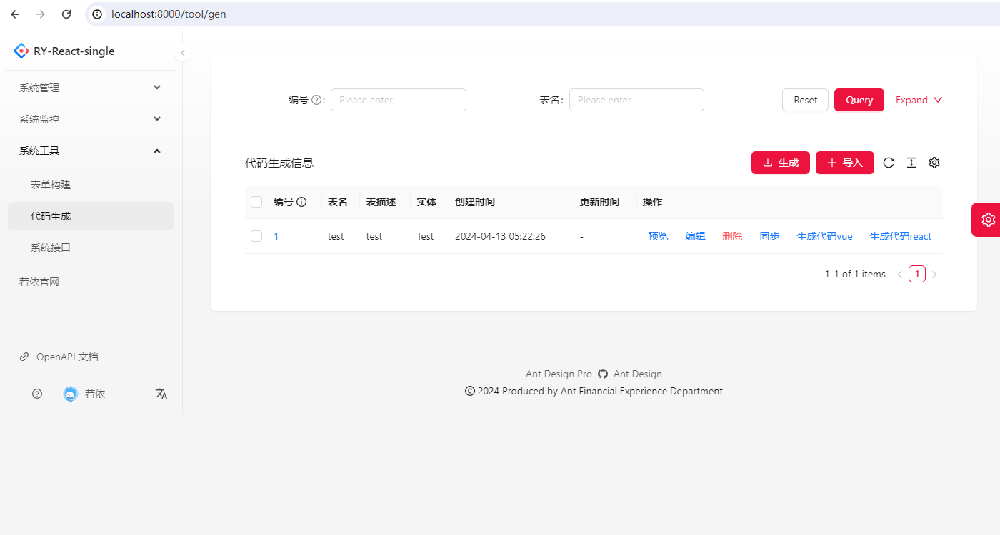

## 平台简介

基于ruoyi vue和Ruoyi-React实现的快速开发工具。

**前端：基于ant-design-pro**
**后端：单体springboot项目(非cloud)+mysql+redis**
**功能：生成前端react代码+后端springboot代码**

若依(Ruoyi-React)是一套全部开源的快速开发平台，毫无保留给个人及企业免费使用。

* 前端采用React 18、Ant Design Pro 6、TypeScript 5。
* 后端采用Spring Boot、Spring Security、Redis & Jwt。
* 权限认证使用Jwt，支持多终端认证系统。
* 支持加载动态权限菜单，多方式轻松权限控制。
* 高效率开发，使用代码生成器可以一键生成前后端代码。

## 内置功能

1. 生成前端react代码+后端springboot代码

   

## 在线体验

- admin/admin123  
- ry/123456

演示地址：暂时没有

## 前端开发注意事项

Node：建议v16或以上

安装依赖请支行：pnpm i

正常启动请运行: pnpm run dev

Mock测试模式请运行: npm run start

发布打包请运行: npm run build

## 相关技术文档

### 后端说明文档

## 部署

## 演示图

